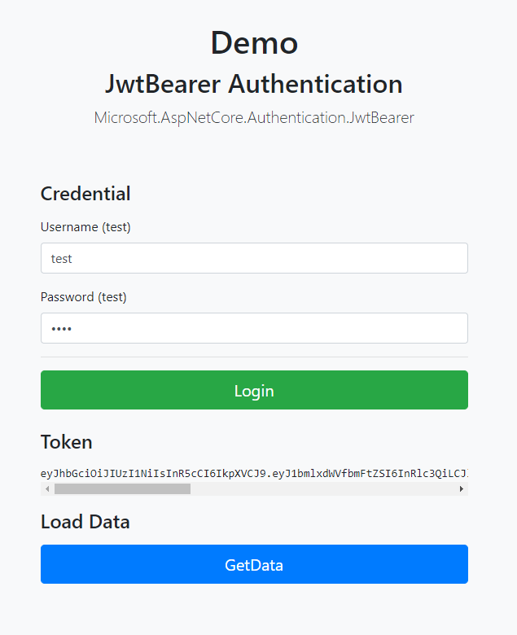

# ASP.NET Core Web Application with JwtBearer Authentication

A very simple example without client side token storing.
Authentication with user password, both values are `test`

``
PM> Install-Package Microsoft.AspNetCore.Authentication.JwtBearer -Version 2.1.0
``

